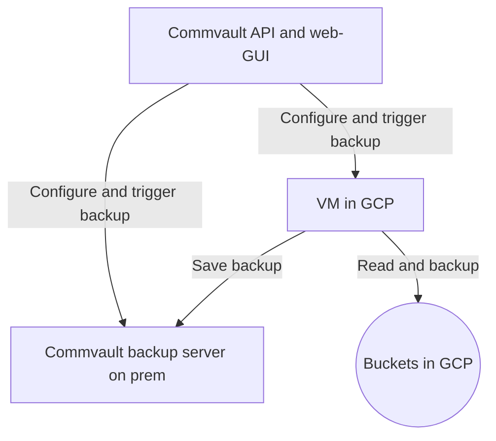

# Terraform Provider for Commvault


The CommvaultX Terraform provider allows you to manage Commvault resources such as clients and, in the future, backup
jobs, directly from Terraform.
This version is maintained by Statistics Norway and is not affiliated with the official Commvault provider.

The provider leverages VM deployed in GCP that connects GCP to CommVault on premise for running backup jobs etc. on GCP buckets.

### Features

- Create and delete Commvault clients.
- Retrieve client information.
- (Planned) Manage backup jobs for Google Cloud Storage buckets.


### Prerequisites for development locally  

- Terraform >= 1.0
- Go (for building from source)
- Access to a Commvault Command Center API endpoint.
- Valid Commvault credentials.

## Terms and concepts

| Term      | Description                                                                                                  |
|-----------|--------------------------------------------------------------------------------------------------------------|
| Client    | High level concept logical collection of subclients                                                          |
| Subclient | Connected to a Client. Targeted to a bucket, and a part of a plan. Can also be run as a Job (one of action). |
| Plan      | A scheduled run of a collection of subclient. The subclients does not need to belong to same client.         |
| Job       | A one of run of a backup                                                                                     |



VM in GCP is configured in: https://github.com/statisticsnorway/terraform-ssb-gcp-org/blob/main/backup.tf

## Local development

### Terraform provider

1. See description at (terraform own tutorial)[https://developer.hashicorp.com/terraform/tutorials/providers-plugin-framework/providers-plugin-framework-provider#prepare-terraform-for-local-provider-install]
   The key in `dev_overrides` block should be `statisticsnorway/commvaultx`, like:
   ```hcl
     dev_overrides {
         "statisticsnorway/commvaultx" = "<PATH>"
     }
   ```
2. Install the provider with with `go install .`
3. Navigate to the `examples` folder and run terraform as usual (`init` and `plan)

### Commvault API explorer

To run requests against the API using the API Explorer (or curl):

1. The Commvault Api Explorer is available over VPN on IP: https://193.160.175.103/webconsole/sandbox/apiexplorer . The
   admin GUI is also avaiable on path `/commandcenter`
2. Username and password are stored in the `org-secrets` GCP-project
3. Base64 encode the password.
4. Get access token by issuing a request to:
    ```shell
    curl -sk -X POST "https://193.160.175.103/commandcenter/api/Login" -H "Content-Type: application/json" \
    -d '{
    "username": "<username in clear text>",
    "password": "<base64 encoded password>",
    "encodeBase64": true
    }'
    ```
5. Get the token, authorize and send requests

