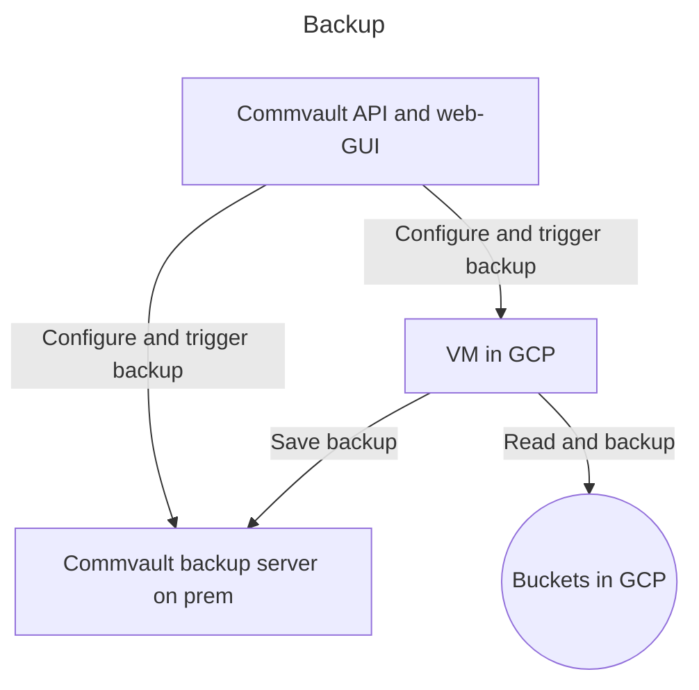

Terraform Provider for CommvaultX

The CommvaultX Terraform provider allows you to manage Commvault resources such as clients and, in the future, backup jobs, directly from Terraform.
This version is maintained by Statistics Norway and is not affiliated with the official Commvault provider.

⸻

🚀 Features
	•	Create and delete Commvault clients.
	•	Retrieve client information.
	•	(Planned) Manage backup jobs for Google Cloud Storage buckets.

⸻

📋 Requirements
	•	Terraform >= 1.0
	•	Go >= 1.21 (for building from source)
	•	Access to a Commvault Command Center API endpoint.
	•	Valid Commvault credentials.

⸻

🛠 Building the Provider Locally

```bash

1. Clone the repo

git clone https://github.com/statisticsnorway/terraform-provider-commvaultx.git
cd terraform-provider-commvaultx

2. Build the provider binary

go build -o terraform-provider-commvaultx

3. Create the local plugin directory (macOS arm64 example)

mkdir -p ~/.terraform.d/plugins/registry.terraform.io/statisticsnorway/commvaultx/0.1.0/darwin_arm64

4. Move the binary into the plugin directory

mv terraform-provider-commvaultx ~/.terraform.d/plugins/registry.terraform.io/statisticsnorway/commvaultx/0.1.0/darwin_arm64/

5. Make it executable

chmod +x ~/.terraform.d/plugins/registry.terraform.io/statisticsnorway/commvaultx/0.1.0/darwin_arm64/terraform-provider-commvaultx
```

⸻

📄 Example Usage

main.tf
```hcl
terraform {
required_providers {
commvaultx = {
source  = “statisticsnorway/commvaultx”
version = “0.1.0”
}
}
}

provider “commvaultx” {
base_url = var.commvault_base_url
username = var.commvault_username
password = var.commvault_password
}

resource “commvaultx_client” “gcp_client” {
name           = var.client_name
plan_id        = var.plan_id
credential_id  = var.credential_id
access_node_id = var.access_node_id
project_id     = var.project_id
}

output “created_client_id” {
value = commvaultx_client.gcp_client.id
}

output “client_response” {
value = commvaultx_client.gcp_client.response
}
```

⸻

variables.tf
```hcl
variable “commvault_base_url” {
description = “Base URL for the Commvault API”
type        = string
}

variable “commvault_username” {
description = “Username for Commvault authentication”
type        = string
}

variable “commvault_password” {
description = “Password for Commvault authentication”
type        = string
sensitive   = true
}

variable “client_name” {
description = “Name of the Commvault client”
type        = string
}

variable “plan_id” {
description = “Plan ID to associate with the client”
type        = number
}

variable “credential_id” {
description = “Credential ID for the Commvault client”
type        = number
}

variable “access_node_id” {
description = “Access Node ID for the Commvault client”
type        = number
}

variable “project_id” {
description = “GCP Project ID”
type        = string
}
```

⸻

terraform.tfvars
```hcl
commvault_base_url = “https://example.com/commandcenter/api”
commvault_username = “example_user”
commvault_password = “example_password”

client_name        = “gcp-commvault-poc”
plan_id            = 1
credential_id      = 6
access_node_id     = 3381
project_id         = “example-projectid”
```

⸻

▶ Initializing and Applying

```bash
terraform init
terraform plan
terraform apply
```

## Terms and concepts

| Term      | Description                                                                                                  |
|-----------|--------------------------------------------------------------------------------------------------------------|
| Client    | High level concept logical collection of subclients                                                          |
| Subclient | Connected to a Client. Targeted to a bucket, and a part of a plan. Can also be run as a Job (one of action). |
| Plan      | A scheduled run of a collection of subclient. The subclients does not need to belong to same client.         |
| Job       | A one of run of a backup                                                                                     |





VM in GCP is configured in: https://github.com/statisticsnorway/terraform-ssb-gcp-org/blob/main/backup.tf

## Local development

To run requests against the API using the API Explorer (or curl):

1. The Commvault Api Explorer is available over VPN on IP: https://193.160.175.103/webconsole/sandbox/apiexplorer . The admin GUI is also avaiable on path `/commandcenter`
2. Username and password are stored in the `org-secrets` GCP-project
3. Base64 encode the password.
4. Get access token by issuing a request to:
    ```shell
    curl -sk -X POST "https://193.160.175.103/commandcenter/api/Login" -H "Content-Type: application/json" \
    -d '{
    "username": "<username in clear text>",
    "password": "<base64 encoded password>",
    "encodeBase64": true
    }'
    ```
5. Get the token, authorize and send requests


